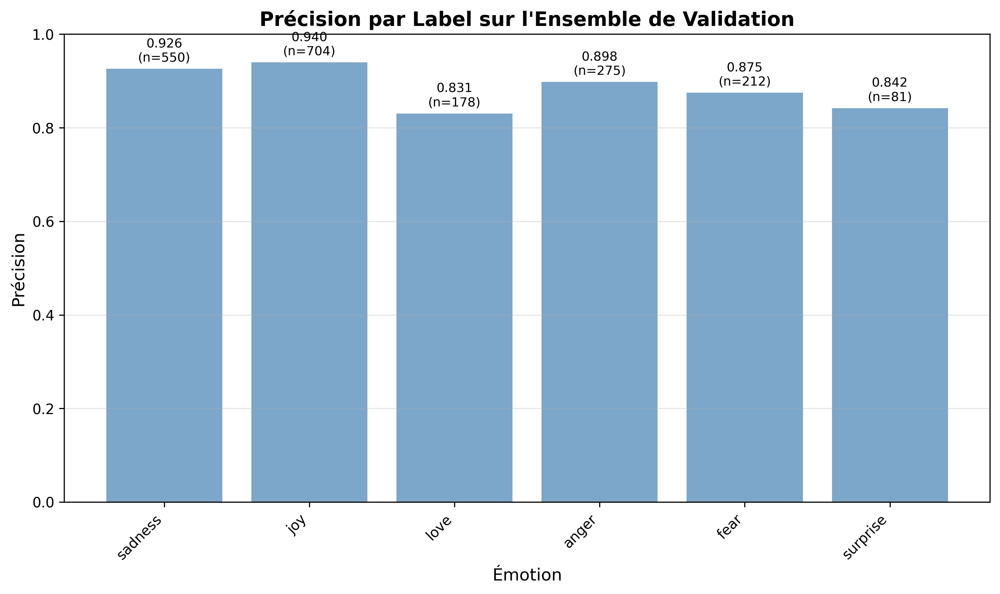
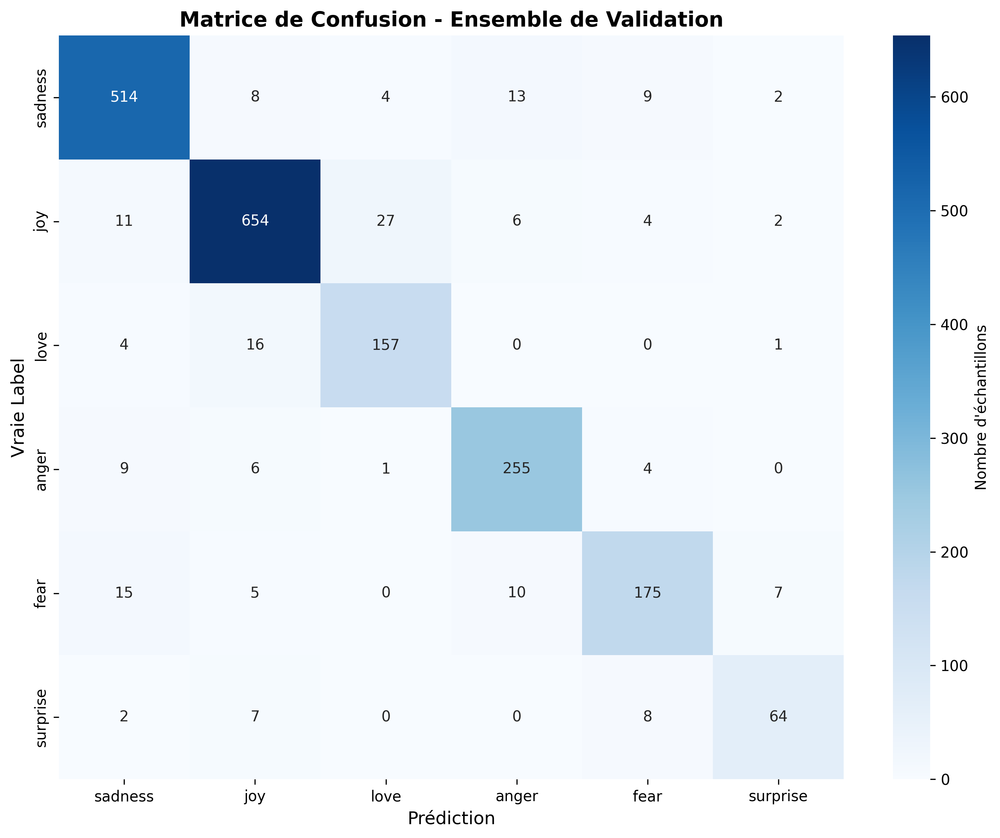
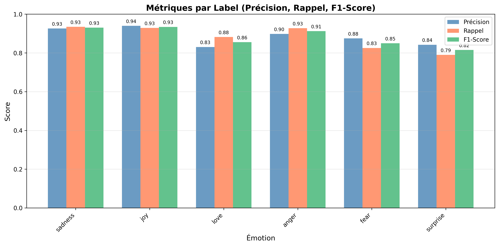

# Exploration de l'Analyse de Sentiment avec un Transformer

Un projet éducatif pour comprendre et implémenter l'architecture Transformer de zéro, appliquée à la classification d'émotions dans des tweets.

## 📚 Objectif et Démarche

Ce projet a été conçu comme une **démarche d'apprentissage** pour découvrir l'architecture Transformer, popularisée par le papier ["Attention Is All You Need"](https://arxiv.org/abs/1706.03762) de Vaswani et al. (2017). 

### Pourquoi ce projet ?

L'objectif était de :
- **Comprendre les mécanismes fondamentaux** des Transformers (attention multi-têtes, encodage positionnel, etc.)
- **Implémenter de zéro** chaque composant plutôt que d'utiliser des bibliothèques pré-construites
- **Appliquer concrètement** ces concepts à un problème réel : la classification d'émotions
- **Visualiser et analyser** les performances du modèle

### Parcours d'apprentissage

1. **Compréhension théorique** : Étude de l'architecture Transformer et de ses composants
2. **Implémentation** : Construction progressive de chaque couche (embeddings, attention, feed-forward, etc.)
3. **Entraînement** : Mise en place du pipeline d'entraînement avec validation
4. **Évaluation** : Analyse détaillée des performances par classe d'émotion
5. **Application** : Création d'une interface de prédiction pour tester le modèle

## 🏗️ Architecture du Modèle

Le modèle implémenté suit l'architecture Transformer classique avec les composants suivants :

### Composants principaux

1. **Token Embedding** : Conversion des tokens en vecteurs de dimension `embed_dim`
2. **Positional Encoding** : Encodage positionnel sinusoïdal pour capturer l'ordre des mots
3. **Multi-Head Attention** : Mécanisme d'attention avec `num_heads` têtes parallèles
4. **Feed-Forward Network** : Réseau feed-forward avec activation GELU
5. **Encoder Blocks** : Empilement de `num_layers` blocs encodeurs
6. **Classification Head** : Couche linéaire finale pour la classification en 6 classes

### Paramètres du modèle

```python
vocab_size = 10000      # Taille du vocabulaire
embed_dim = 512         # Dimension des embeddings
num_heads = 8           # Nombre de têtes d'attention
ff_dim = 2048           # Dimension du réseau feed-forward
num_layers = 4          # Nombre de blocs d'encodeur
max_length = 256        # Longueur maximale des séquences
num_classes = 6         # Nombre de classes d'émotions
dropout = 0.1           # Taux de dropout
```

**Note importante** : `embed_dim` doit être divisible par `num_heads` pour que l'attention multi-têtes fonctionne correctement.

## 📊 Dataset

Le projet utilise le dataset [**dair-ai/emotion**](https://huggingface.co/datasets/dair-ai/emotion) de HuggingFace, qui contient des tweets annotés avec 6 émotions :

- **0** : sadness (tristesse)
- **1** : joy (joie)
- **2** : love (amour)
- **3** : anger (colère)
- **4** : fear (peur)
- **5** : surprise (surprise)

**Statistiques du dataset** :
- **Train** : 16 000 échantillons
- **Validation** : 2 000 échantillons
- **Test** : 2 000 échantillons

### Préprocessing

Les textes sont nettoyés pour :
- Supprimer les URLs
- Normaliser les accents (unidecode)
- Supprimer les mentions (@username) et hashtags (#tag)
- Supprimer les caractères spéciaux

## 🚀 Utilisation

### Installation

```bash
# Installer les dépendances avec uv (ou pip)
uv sync
```

### Entraînement du modèle

```bash
python -m src.train
```

Le script va :
- Construire le vocabulaire à partir des données d'entraînement
- Créer les DataLoaders pour train/validation/test
- Entraîner le modèle sur 20 époques
- Sauvegarder le meilleur modèle dans `checkpoints/best_model.pt`
- Sauvegarder le tokenizer dans `checkpoints/tokenizer.pt`

### Évaluation du modèle

```bash
python -m src.evaluate
```

Ce script génère :
- Un rapport de classification détaillé
- Des métriques par label (précision, rappel, F1-score)
- Des visualisations dans le dossier `results/` (également visibles dans la section [Résultats](#-résultats) ci-dessous) :
  - `precision_by_label.png` : Précision par émotion
  - `confusion_matrix.png` : Matrice de confusion
  - `metrics_by_label.png` : Comparaison précision/rappel/F1

### Prédiction sur un texte

**Mode interactif** :
```bash
python -m src.predict
```

**Avec argument** :
```bash
python -m src.predict "I am so happy today!"
```

Le script affiche :
- L'émotion prédite
- Les probabilités pour toutes les classes
- Un graphique des probabilités

## 📈 Résultats

### Performance globale

Le modèle atteint une **accuracy de validation** qui varie selon les hyperparamètres utilisés. Les résultats détaillés sont disponibles dans les graphiques générés par `evaluate.py`.

### Métriques par classe

Les visualisations ci-dessous montrent les performances détaillées du modèle :

#### Précision par Label



Ce graphique montre la **précision** (capacité du modèle à ne pas faire de faux positifs) pour chaque émotion. Les valeurs affichées au-dessus des barres indiquent la précision et le nombre d'échantillons (support) pour chaque classe.

#### Matrice de Confusion



La matrice de confusion révèle les **confusions fréquentes** entre classes. Les valeurs sur la diagonale représentent les prédictions correctes, tandis que les valeurs hors diagonale indiquent les erreurs de classification.

#### Métriques Complètes (Précision, Rappel, F1-Score)



Cette visualisation compare trois métriques importantes pour chaque émotion :
- **Précision** : Capacité du modèle à ne pas faire de faux positifs
- **Rappel** : Capacité du modèle à trouver tous les vrais positifs
- **F1-Score** : Moyenne harmonique de la précision et du rappel

### Analyse des résultats

Les graphiques permettent d'identifier :
- Les émotions les mieux classées par le modèle
- Les confusions fréquentes entre classes (via la matrice de confusion)
- Les classes potentiellement sous-représentées dans le dataset
- Les métriques qui nécessitent une amélioration (faible rappel ou précision)

## 🧠 Concepts Appris

### 1. Attention Multi-Têtes

L'attention permet au modèle de se concentrer sur différentes parties de la séquence simultanément. Avec plusieurs têtes, le modèle peut capturer différents types de relations.

### 2. Encodage Positionnel

Contrairement aux RNN, les Transformers n'ont pas de notion innée d'ordre. L'encodage positionnel sinusoïdal ajoute cette information aux embeddings.

### 3. Architecture Encoder-Only

Pour la classification, seule la partie encodeur est nécessaire. Le modèle transforme la séquence en représentation puis fait un pooling pour la classification.

### 4. Masques d'Attention

Les masques permettent d'ignorer les tokens de padding, essentiel pour gérer des séquences de longueurs variables.

## 📁 Structure du Projet

```
basic-sentiment-analysis-with-transformer/
├── src/
│   ├── model.py          # Architecture Transformer complète
│   ├── data.py           # Chargement et preprocessing des données
│   ├── tokenizer.py      # Tokenizer simple basé sur les mots
│   ├── train.py          # Script d'entraînement
│   ├── evaluate.py       # Script d'évaluation avec visualisations
│   └── predict.py        # Script de prédiction interactive
├── checkpoints/          # Modèles sauvegardés
├── results/              # Graphiques d'évaluation
└── README.md
```

## 🔧 Dépendances

- `torch` : Framework de deep learning
- `datasets` : Chargement du dataset HuggingFace
- `matplotlib` & `seaborn` : Visualisations
- `scikit-learn` : Métriques d'évaluation
- `tqdm` : Barres de progression
- `unidecode` : Normalisation des caractères

## 🎯 Prochaines Étapes Possibles

- [ ] Expérimentation avec différents hyperparamètres
- [ ] Comparaison avec des modèles pré-entraînés (BERT, RoBERTa)
- [ ] Analyse de l'attention (visualisation des poids d'attention)
- [ ] Fine-tuning sur un dataset spécifique
- [ ] Déploiement en API REST

## 📝 Notes

Ce projet est avant tout **éducatif**. Pour des applications en production, il est recommandé d'utiliser des modèles pré-entraînés comme BERT ou des architectures plus récentes, qui bénéficient de l'entraînement sur de vastes corpus.

## 📄 Licence

Ce projet est à des fins éducatives.

---

**Auteur** : Exploration personnelle des Transformers  
**Date** : 2025
